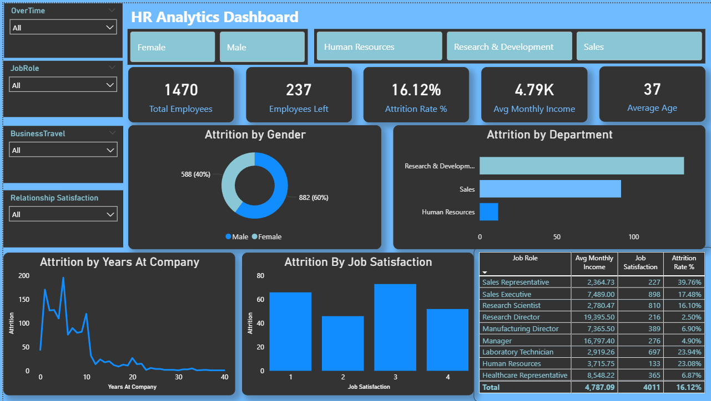

# HR Analytics & Employee Attrition Dashboard

**Author:** Abhishek Bawane — Data Analyst
**Tools:** Power BI · DAX · Python · SQL (MySQL)
**Dataset:** IBM HR Analytics Employee Attrition & Performance (1,470 employees, 35 features)

---

## 📌 Problem Statement

Employee attrition is a costly, often preventable problem for organizations. This project analyzes HR data to answer:
- What is the overall attrition rate, and which departments/roles are most affected?
- Which employee segments (tenure, satisfaction, job role) are at highest risk of leaving?
- How does compensation relate to attrition across roles?

The output is an interactive Power BI dashboard that HR stakeholders can use to identify at-risk groups and prioritize retention efforts.

---

## 📊 Dashboard Preview



**Interactive filters:** OverTime, Job Role, Business Travel, Relationship Satisfaction, Gender, and Department (via clickable cards).

---

## 🔑 Key Insights

- **Overall attrition rate is 16.12%** — 237 of 1,470 employees have left, with an average monthly income of ₹4.79K and average age of 37 across the workforce.
- **Sales Representatives have by far the highest attrition rate (39.76%)**, despite having one of the lowest average incomes (₹2,364.73) — a strong signal that this role is a retention priority.
- **Research Director and Manager roles are the most stable** (2.50% and 4.90% attrition respectively), correlating with the highest average incomes (₹19,395.50 and ₹16,797.40) — suggesting compensation and seniority strongly protect against attrition.
- **Laboratory Technicians (23.94%) and Human Resources staff (23.08%)** show elevated attrition despite modest headcounts, making them a secondary focus area.
- **Attrition is heavily concentrated in early tenure** — the "Attrition by Years at Company" trend spikes sharply within the first ~5 years and drops off almost entirely after year 10, indicating the first few years are the critical retention window.
- **Job Satisfaction level 3 sees the highest volume of attrition**, not level 1 as might be expected — suggesting attrition isn't purely dissatisfaction-driven and other factors (pay, role, workload) interact with satisfaction.
- **Gender split of leavers is 60% male / 40% female** (882 vs 588), roughly proportional to workforce composition rather than indicating a gender-specific attrition pattern.
- **Research & Development has the largest volume of departures** among departments, followed by Sales, with Human Resources contributing the fewest in absolute terms (though a high rate relative to its size).

---

## 🧮 Dashboard Components

| Visual | Purpose |
|---|---|
| KPI Cards | Total Employees, Employees Left, Attrition Rate %, Avg Monthly Income, Average Age |
| Donut Chart | Attrition split by Gender |
| Bar Chart | Attrition volume by Department |
| Line Chart | Attrition trend across Years at Company (identifies the tenure risk window) |
| Bar Chart | Attrition volume by Job Satisfaction level |
| Matrix Table | Job Role × Avg Monthly Income × Headcount × Attrition Rate %, sortable |
| Slicers | OverTime, Job Role, Business Travel, Relationship Satisfaction, Gender, Department |

---

## 📐 Key DAX Measures

```
Total Employees = COUNTROWS(employees)

Attrition Count = 
CALCULATE(COUNTROWS(employees), employees[Attrition] = "Yes")

Attrition Rate % = 
DIVIDE([Attrition Count], [Total Employees], 0)

Avg Monthly Income = 
AVERAGE(employees[MonthlyIncome])

Average Age = 
AVERAGE(employees[Age])
```

---

## 🛠 Tools Used

- **Power BI Desktop** — dashboard design, DAX measures, slicers, and cross-filtering
- **Python (Pandas, Seaborn, Matplotlib)** — exploratory data analysis feeding dashboard design decisions
- **MySQL** — data storage and analytical SQL queries (attrition by department, tenure, salary hike buckets)

---

## 📂 Repository Structure

```
HR-Analytics-Attrition-Dashboard/
├── data/               # raw & processed data (gitignored — see Setup)
├── sql/                # schema + analytical queries
├── notebooks/          # EDA, preprocessing, driver analysis
├── powerbi/            # HR_Attrition_Dashboard.pbix
├── images/             # dashboard screenshots
├── requirements.txt
├── .gitignore
└── README.md
```

---

## ▶️ How to Run

1. Clone the repo:
   ```bash
   git clone https://github.com/<your-username>/HR-Analytics-Attrition-Dashboard.git
   cd HR-Analytics-Attrition-Dashboard
   ```
2. Install Python dependencies:
   ```bash
   pip install -r requirements.txt
   ```
3. Download the dataset from [Kaggle — IBM HR Analytics Employee Attrition](https://www.kaggle.com/datasets/pavansubhasht/ibm-hr-analytics-attrition-dataset) and place it in `data/raw/`.
4. Load data into MySQL using `sql/02_load_data.sql`, then run the queries in `sql/03_analysis_queries.sql`.
5. Run the notebooks in `notebooks/` in order for EDA and preprocessing.
6. Open `powerbi/HR_Attrition_Dashboard.pbix` in Power BI Desktop to explore the interactive dashboard.

---

## 👤 Author

**Abhishek Bawane**
Data Analyst | Python · SQL · Power BI
Pune, Maharashtra
